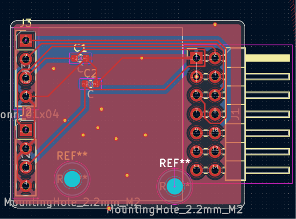
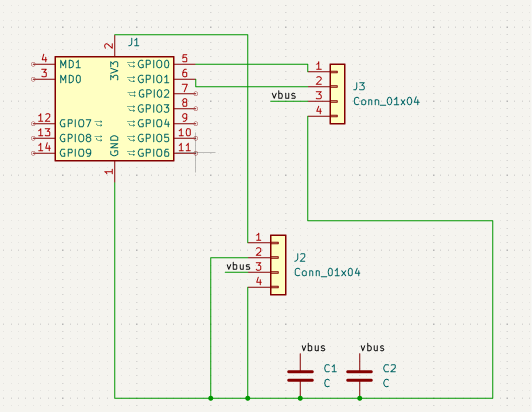
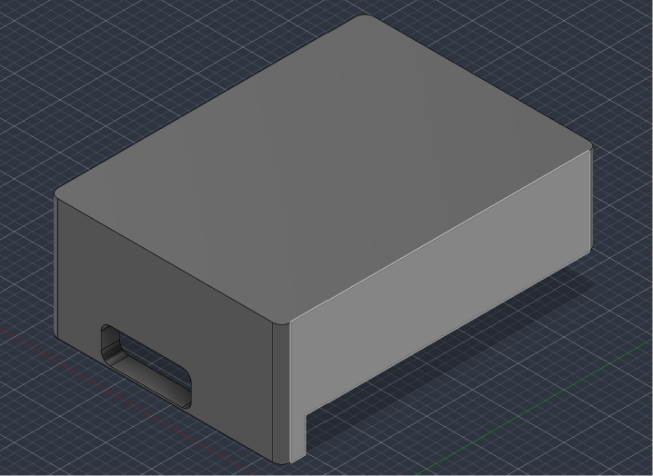

# Dongle Host Module for HackXpansion console

A USB-host bridge module that lets a full sized controller to be be read by the Hackxpansion console.

Key features:
* Raspberry Pi Pico as the USB host controller
* Boost-converter-fed VBUS so the Pico can power the dongle
* UART link to the console over the J1 connector
## PCB

## Schematic

## 3D Case

## Bill of Materials (excluding console)
Also found in [bom.csv](./bom.csv).

| Item                                        | Price per unit                   | Nr of units | Total price            | Link                                                    |
| ------------------------------------------- | -------------------------------- | ----------- | ---------------------- | ------------------------------------------------------- |
| Raspberry Pi Pico                           | $4.00                            | 1           | $4.00                  | https://www.raspberrypi.com/products/raspberry-pi-pico/ |
| MT3608 boost converter breakout             | ~$1-4 (pack pricing varies)      | 1           | ~$1-4                  | -                                                       |
| 2x20 2.54mm female pin socket (Pico mount)  |  -                               | 1           | -                      | -                                                       |
| 2x7 2.54mm pin header (J1)                  | ~$0.20-0.39                      | 1           | ~$0.20-0.39            | https://www.aliexpress.com/item/4000186187780.html      |
| 1x04 2.54mm pin header (boost converter)    | ~$0.10                           | 1           | ~$0.10                 | -                                                       |
| 1x02 2.54mm pin header + jumper (power cut) | ~$0.10                           | 1           | ~$0.10                 | -                                                       |
| MD0/MD1 ID resistors, 0603                  |-                                 | 2           | -                      | -                                                       |
| 10uF electrolytic + 100nF ceramic cap       | -                                | 1 each      | -                      | -                                                       |
| Micro-USB-to-USB-A OTG adapter cable        |  -                               | 1           | -                      | -                                                       |
| PCB fab                                     |   -                              | 1           | -                      | https://jlcpcb.com/                                     |
| **Total**                                   |                                  |             | ~$10 without controller |                                                         |

## Credits
* USB host HID parsing (DS4 report handling): [TinyUSB](https://github.com/hathach/tinyusb),
  `examples/host/hid_controller/src/hid_app.c`, by hathach and contributors
* Console-side UART driver pattern:   [`wardriving-driver`](https://docs.rs/crate/wardriving-driver) crate's UART bus usage
* Driver : [`xpanse_api`](https://docs.rs/xpanse-api)
* Raspberry Pi Pico hardware: [Raspberry Pi](https://www.raspberrypi.com/products/raspberry-pi-pico/)
* Thanks to Hack Club and the HackXpansion team for the console platform this module plugs into: https://github.com/hackclub/hackxpansion
* Thanks to the OpenSplitDeck project for the dongle this module is built to read as an example
